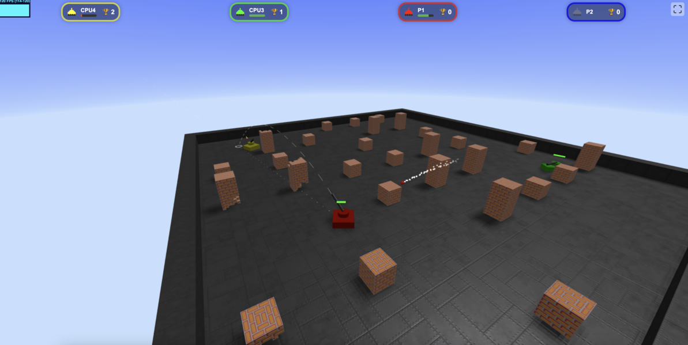
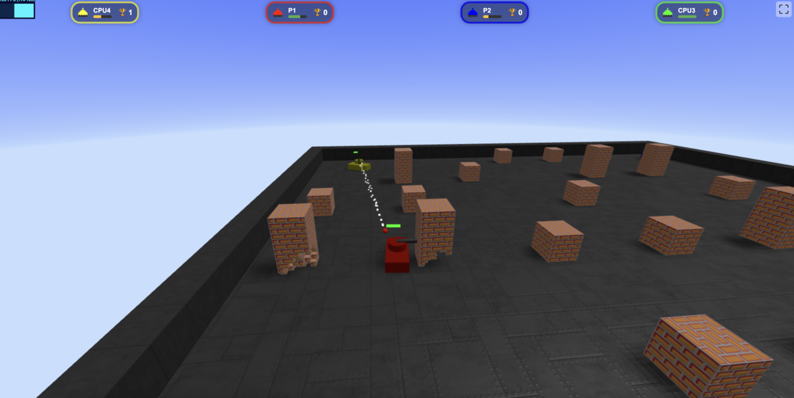
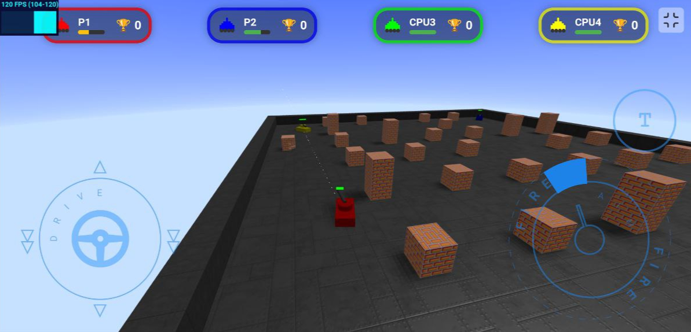
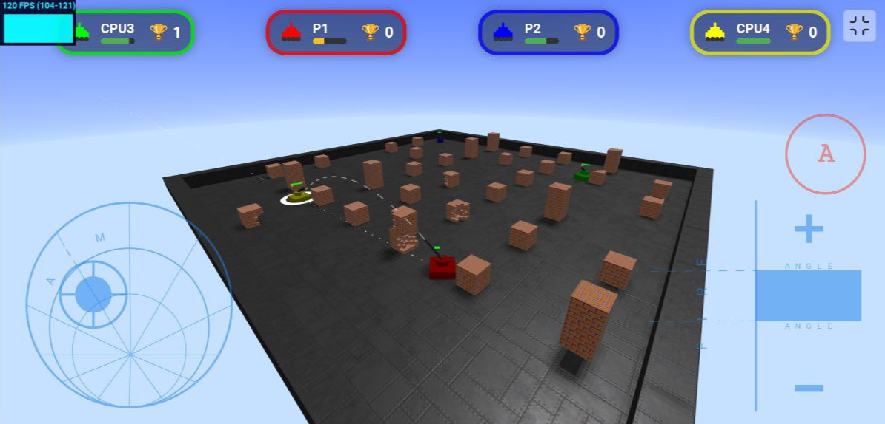

# 3D Tank Game

A 3D tank battle game built with Three.js and Cannon.js physics engine.



## Features

- Fully 3D environment with realistic physics
- Multiple game modes: single-player and multiplayer
- Direct and indirect firing modes
- Destructible environment
- AI opponents with pathfinding capabilities
- Mobile and desktop controls
- Scoreboard and player statistics

## Technologies Used

- **Three.js** - 3D rendering engine
- **Cannon.js** - Physics engine
- **JavaScript** - Core programming language
- **WebSockets** - Real-time multiplayer functionality
- **WebWorkers** - Background processing

## Game Controls

### Desktop Controls

- **W/A/S/D** - Move the tank forward/left/backward/right
- **Mouse** - Aim the turret
- **Left Click** - Switch between direct and indirect fire modes
- **Space** - Hold to charge shot power, release to fire
- **Space** (when destroyed) - Respawn



### Mobile Controls

- **Left Joystick** - Move the tank
- **Right Joystick** - Aim and fire
- **Mode Button** - Switch between direct and indirect fire modes




## Game Modes

### Direct Fire Mode

In this mode, the tank fires directly at targets. The projectile follows a relatively flat trajectory affected by gravity.

### Indirect Fire Mode

In this mode, the tank acts more like artillery, firing projectiles in a high arc to hit targets behind obstacles. The barrel angle and shot power can be adjusted for precision.

## AI Behavior

The AI opponents use a sophisticated behavior system:

- Pathfinding to navigate around obstacles
- Target selection based on proximity and line of sight
- Different states including search, siege, and attack
- Adaptive firing modes depending on the situation

## Multiplayer

The game supports multiplayer functionality through WebSockets. Players can create or join game sessions to battle against other players.

## Installation and Setup

### Play Online

You can play the single-player version of the game directly in your browser:
[Play 3D Tank Game](https://lempiy.github.io/battle_city_3d_multiplayer)

### Prerequisites

- Node.js
- npm or yarn

### Installation

1. Clone the repository

```bash
git clone https://github.com/yourusername/3d-tank-game.git
cd 3d-tank-game
```

2. Install dependencies

```bash
npm install
```

3. Start the development server

```bash
npm start
```

4. Open your browser and navigate to `http://localhost:8080`

### Building for Production

```bash
npm run build
```

## Server Deployment

To deploy the multiplayer server:

```bash
npm run server
```

The server will start on port 9001 by default, or you can specify a different port using the PORT environment variable.

## Project Structure

- `/src` - Source code
  - `/game` - Game logic and mechanics
  - `/controllers` - Game controllers
  - `/providers` - Network communication
  - `/assets` - Game assets (textures, models, etc.)

## License

This project is licensed under the MIT License - see the LICENSE file for details.

---

# 3D Танкова Гра

Тривимірна танкова гра, побудована на Three.js та фізичному рушії Cannon.js.


## Функціональність

- Повністю тривимірне середовище з реалістичною фізикою
- Кілька режимів гри: одиночний та багатокористувацький
- Прямий та непрямий режими стрільби
- Руйнівне оточення
- ШІ-опоненти з можливістю пошуку шляху
- Керування для мобільних пристроїв та ПК
- Таблиця результатів та статистика гравців

## Використані технології

- **Three.js** - Рушій для 3D-рендерингу
- **Cannon.js** - Фізичний рушій
- **JavaScript** - Основна мова програмування
- **WebSockets** - Функціональність багатокористувацької гри в реальному часі
- **WebWorkers** - Фонова обробка даних

## Керування грою

### Керування на ПК

- **W/A/S/D** - Рух танка вперед/вліво/назад/вправо
- **Миша** - Наведення вежі
- **Ліва кнопка миші** - Перемикання між прямим та непрямим режимами вогню
- **Пробіл** - Утримуйте для збільшення сили пострілу, відпустіть для вогню
- **Пробіл** (коли танк знищено) - Відродження


### Керування на мобільних пристроях

- **Лівий джойстик** - Рух танка
- **Правий джойстик** - Прицілювання та вогонь
- **Кнопка режиму** - Перемикання між прямим та непрямим режимами вогню


## Режими гри

### Режим прямого вогню

У цьому режимі танк стріляє безпосередньо по цілях. Снаряд летить за відносно пласкою траєкторією під впливом гравітації.

### Режим непрямого вогню

У цьому режимі танк діє більше як артилерія, випускаючи снаряди під високою дугою, щоб вразити цілі за перешкодами. Кут ствола та сила пострілу можуть бути відрегульовані для точності.

## Поведінка ШІ

Опоненти з ШІ використовують складну систему поведінки:

- Пошук шляху для навігації навколо перешкод
- Вибір цілі на основі близькості та лінії прямої видимості
- Різні стани, включаючи пошук, облогу та атаку
- Адаптивні режими стрільби залежно від ситуації

## Багатокористувацька гра

Гра підтримує багатокористувацьку функціональність через WebSockets. Гравці можуть створювати або приєднуватися до ігрових сесій, щоб воювати проти інших гравців.

## Встановлення та налаштування

### Гра онлайн

Ви можете грати в одиночну версію гри безпосередньо у вашому браузері:
[Грати в 3D Танкову Гру](https://lempiy.github.io/battle_city_3d_multiplayer)

### Передумови

- Node.js
- npm або yarn

### Встановлення

1. Клонуйте репозиторій

```bash
git clone https://github.com/yourusername/3d-tank-game.git
cd 3d-tank-game
```

2. Встановіть залежності

```bash
npm install
```

3. Запустіть сервер розробки

```bash
npm start
```

4. Відкрийте ваш браузер і перейдіть за адресою `http://localhost:8080`

### Збірка для виробництва

```bash
npm run build
```

## Розгортання сервера

Для розгортання багатокористувацького сервера:

```bash
npm run server
```

Сервер стартуватиме на порту 9001 за замовчуванням, або ви можете вказати інший порт, використовуючи змінну середовища PORT.

## Структура проекту

- `/src` - Вихідний код
  - `/game` - Логіка та механіка гри
  - `/controllers` - Контролери гри
  - `/providers` - Мережева комунікація
  - `/assets` - Ігрові ресурси (текстури, моделі тощо)

## Ліцензія

Цей проект ліцензований за ліцензією MIT - див. файл LICENSE для деталей.
